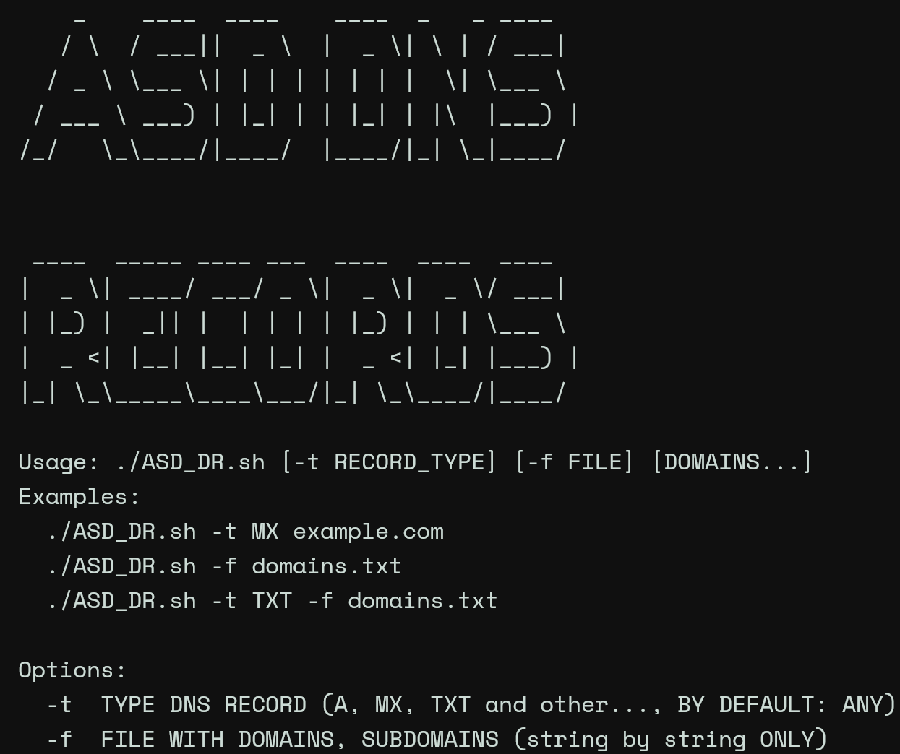

# What's up. It's useful bash script for DNS requests.

### Recently, I thought, why I can't do DNS requests using my list of domains. Sooo

- I didn't find any utils for DNS requests, using my txt file including subdomains, eventually i decided create this BASH script with minimal dependencies, it's only dig, for DNS requests.

# Have a good experience, with using this one

